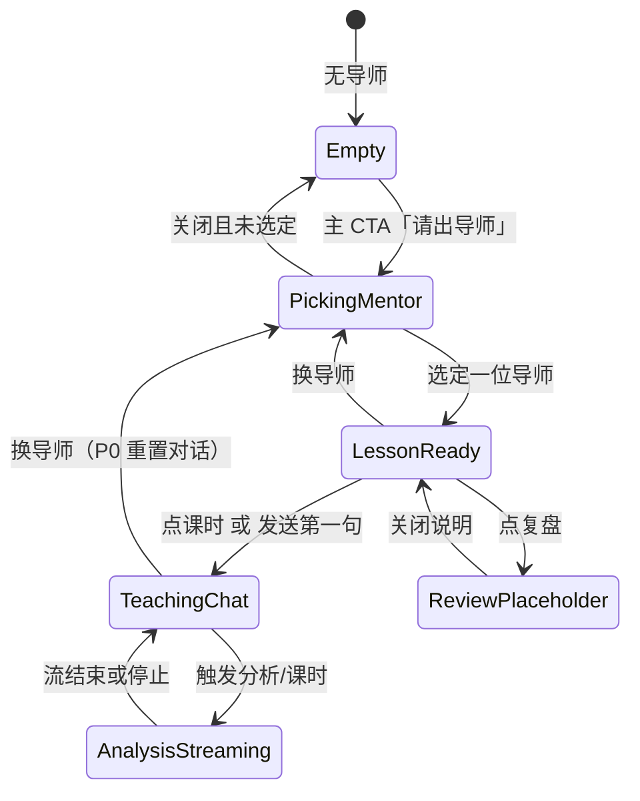

# 英雄导师 UI v2 — Grok 式 Mentor 设计稿

> **性质**：设计文档，不实现生产 UI。  
> **范围**：仅「AI 教练」页（`CoachView`）。英雄百科保持独立。  
> **权威隐喻**：Dota 2 **英雄是导师**，**用户是学员**。导师用该英雄主玩者的口吻授课，而不是通用问答机器人。

---

## 0. 为什么停掉「再打磨空态」

当前线上空态（`WelcomeState`）是典型 LLM 聊天落地页：

- 居中 sparkle 图标 + 一句通用招呼
- 反白「选英雄」大按钮
- 两条宽 pill 建议提示（选双方阵容 / 版本强势）
- 底部「输入其他问题…」composer

它功能成立，但人格是 **ChatGPT 皮肤**，不是 **英雄在教你打 Dota**。继续微调 pill 文案、图标或居中间距，只会把「通用聊天空态」打磨得更像通用聊天空态。

v2 不再优化这张空态。空态的唯一任务是：**请出一位导师英雄，然后进入课时。**

---

## 1. 产品信息架构

### 1.1 角色与边界

| 角色 | 是谁 | 不是谁 |
|------|------|--------|
| **导师 (Mentor Hero)** | 用户选定的 **一位** 英雄。会话人格、口吻、默认课时都绑定这位英雄。 | 不是「双方阵容集合」，不是「AI 教练」抽象头像 |
| **学员 (User)** | 来学「怎么把这个英雄打好」的人 | 不是来和通用战术助手闲聊的人 |
| **课时 (Lesson Mode)** | 导师今天要教的课：BP / 对局 / 出装 / 思路；复盘仅占位 | 不是一排互不相关的 prompt chip |
| **阵容上下文 (Draft Context)** | 课时需要时附带的天辉/夜魇名单（尤其 BP、对局） | 不是进入教练页的第一道门槛 |
| **英雄百科** | 查阅技能、传说、静态资料 | 不承担授课；导师头像可跳去百科，但不把百科嵌进教练空态 |

**先选导师，再选课时。** 阵容是课时道具，不是入场券。版本大盘可以在「没有导师」时作为弱出口，但不得与「请导师」抢主 CTA。

### 1.2 主路径

```
打开「AI 教练」
    │
    ├─ 无导师 ──────────► [空态] 唯一主 CTA：请出导师
    │                         │
    │                         ▼
    │                    [选导师]
    │                         │
    ▼                         ▼
有导师 ────────────────► [课时条] BP / 对局 / 出装 / 思路 / 复盘(占位)
                              │
                              ▼
                         [授课对话]
                              │
                              ▼
                         [分析流式] 导师开口 + OpenDota 锚点
```

### 1.3 课时模式

课时是 **导师教案**，不是「对这个模型说一句什么」。每门课有默认开场、需要的上下文、以及导师会引用的 OpenDota 公开数据。禁止编造英雄数值、版本平衡或未标注的比赛事实。

| 模式 id | 中文 | English | 导师在教什么 | 需要的上下文 | OpenDota 锚点（公开 API） | 分期 |
|---------|------|---------|--------------|--------------|---------------------------|------|
| `bp` | BP | Ban/Pick | 以该英雄视角看选人、反选、站位、何时亮他 | 导师英雄 **必选**；双方阵容 **可选，越全越好** | 英雄对位胜率、样本数、建议下一手（已有 `/api` 建议流） | P0 |
| `match` | 对局 | This game | 这把怎么打：节奏、对线、团战站位、赢面 | 导师英雄 **必选**；己方至少 1 人；敌方越全越好 | 对位、出装流行度、样本（已有 playbook 流） | P0 |
| `items` | 出装 | Item build | 为什么做出门 / 前中后期件；对这套阵容怎么改 | 导师英雄 **必选** | 职业/高分出装流行度与时机（已有 item 统计） | P0 |
| `mind` | 思路 | Game sense | 决策顺序：何时打、何时怂、技能交换、视野与资源 | 导师英雄 **必选**；阵容可选 | 仅引用已拉到的对位/胜率；没有数据就明说「这是判断，不是统计」 | P0 |
| `review` | 复盘 | Replay review | 看录像：节点、死亡、装备差、决策回放 | 比赛 ID / 录像（未做） | 以后：OpenDota match 详情；**现在不做** | Later |

**复盘** 在课时条上可见但禁用，hover / 点击给出占位说明，避免用户以为产品已经能读录像。

### 1.4 与现有能力的映射（实现时对照，本 PR 不改代码）

| 现有动作 | 现有入口 | v2 归属 |
|----------|----------|---------|
| `analyze` 阵容对抗流 | `WelcomeState` / `IntentChips` | 课时 `bp`（有双方）或 `match`（已开打视角） |
| `playbook` 本局怎么打 | 需己方英雄 | 课时 `match` |
| `suggest` 下一手 | 己方未满 | 课时 `bp` 的子动作，不是顶层并列 chip |
| `meta` 版本强势 | 空态第二条 pill | **降级**：无导师时的弱出口；有导师后不再当主路径 |
| `ProMatchStrip` 职业/高分轮播 | 独立组件 | **教练页永不挂载**（硬约束） |
| 英雄百科 `HeroHub` | 顶栏另一 tab | 保持；导师肖像可打开详情，不替代授课 |

### 1.5 会话对象（概念，非本 PR 类型）

```
MentorSession
  mentor: Hero                 // 一位，会话人格绑定
  lesson: 'bp' | 'match' | 'items' | 'mind' | 'review'
  draft?: { radiant, dire }    // 课时上下文，可空
  messages: MentorMessage[]
  grounding: 'opendota' | 'unverified'
```

切换导师 = 新开一堂课（清空消息，保留或丢弃阵容由 P1 决定）。P0：切换导师即重置对话。

---

## 2. 屏幕地图

四个主画面，加上一个「有导师、尚未开口」的过渡态。不要再增加第五张「通用欢迎页」。



### 2.1 空态 Empty — 无导师

**目的**：请人来教，不是请人来聊天。

**布局（桌面 / 移动同一结构，垂直居中偏上）**

1. **导师空位**：大号英雄肖像框（约 96×96，圆角 8px，`surface` 底 + 细边框）。框内不是 sparkle，而是空位：细线剪影或「？」——像选人界面还没 lock。
2. **一句导师视角的标题**（中文默认）：「今天谁教你。」 / `Who is teaching you today.`
3. **一句副文**：点明学员身份，禁止「有什么可以帮你」。
4. **唯一主 CTA**：反白实心按钮「请出导师 ›」 / `Call your mentor ›`
5. **弱出口（可选，一条文字链，不是 pill）**：「先看版本谁强」 / `Check the patch first` → 走现有 meta，但视觉权重远低于主 CTA。
6. **底部 composer 降级**：占位「问一句也可以，但先请导师会准得多」——允许自由输入，**不**用发送键当本屏主 CTA。无导师时提交：导师用短句把学员赶回选人（见文案表），不假装已经在教某位英雄。

**禁止出现在本屏**：sparkle 徽章、宽 pill 建议条、职业/高分比赛条、双方阵容大按钮作为第一动作。

### 2.2 选导师 Picking Mentor

**目的**：Lock **一位** 英雄当导师。不是先填天辉五人。

复用现有 `HeroPickerOverlay` 的网格、搜索、属性过滤，但 **重题**：

| 元素 | 行为 |
|------|------|
| 标题 | 「请出导师」 / `Call your mentor` |
| 选择模型 | **单选**。点第二位即替换第一位，不进双侧草稿 |
| 已选预览 | 顶部一条：大头像 + 中英文名 + 「他来教你」 |
| 天辉/夜魇切换 | **本屏不出现**。阵容归属课时 `bp` / `match`，另开「补阵容」 |
| 确认 | 点英雄即可落座并关层（少一步）。键盘：Enter 确认高亮项，Esc 关闭 |
| 重置 | 仅在已有导师时显示「退下」 / `Dismiss` |

关闭遮罩：`bg-black/80` 即可。这是交互层，**不是**给数据截图盖灰。禁止为了「像 Dotabuff」去截图再蒙一层。

### 2.3 课时就绪 Lesson Ready — 有导师、尚未开口

选定导师后、第一条消息出现前。**不要回到 sparkle 空态。**

**布局**

- **左/上：导师席**  
  英雄头像（官方肖像，来自现有 `hero.img`）+ 中文名为主、英文名为辅 + 一句该英雄气质的坐下台词（见 §7，P0 可用通用导师句，P1 再按英雄特化）。
- **课时条（主交互）**  
  五个模式：`BP` `对局` `出装` `思路` `复盘`。前四个可点，复盘禁用。
- **本屏主 CTA**  
  默认高亮 **思路**（学英雄）或用户上次课时。视觉：反白填充落在 **一个** 课时上，其余为 ghost。
- **阵容条（次级）**  
  压缩的 `DraftContextChip`：「这堂课要对谁打」——空则显示「补双方英雄（可选）」文字链，**不是**反白大按钮。
- **Composer**  
  占位带导师名：「直接问 {英雄}，或选一堂课」。有内容时发送键才升为反白。

点课时 = 写入一条学员消息（课时标签）+ 立刻进入流式授课。不必再确认。

### 2.4 授课对话 Teaching Chat

标准对话列（沿用 `max-w-3xl`），但每条导师气泡有 **人格头**，不是「AI Coach」灰字：

```
[导师头像 24]  冥魂大帝 · 思路
               正文……
               [基于 OpenDota 数据] 或 [判断，数据未验证]
```

学员气泡保持现有右/左层次，不要做成 Messenger 彩色泡。

**顶栏（对话开始后钉在内容区上方，不进 App header）**

- 导师小头像 + 名
- 当前课时（可切换，切换即新开一条导师课，不改历史气泡的课时标签）
- 「换导师」文字链
- 阵容 chip（编辑双侧）

**Composer 区（底）**

1. 课时条（短标签，当前课反白描边或字重，不五颗都做成主按钮）
2. 阵容 chip
3. 输入 + 发送

`IntentChips` 那组「分析阵容 / 本局打法 / 推荐下一手 / 看看大盘」**不再作为主导航**。其能力并进课时：下一手 ⊂ BP，大盘降为溢出菜单或弱链。

### 2.5 分析流式 Analysis Streaming

与授课同屏，不另开 modal。

| 规则 | 说明 |
|------|------|
| 主 CTA | **停止**（ghost + 细 X）。发送键禁用。 |
| 光标 | 沿用 `.streaming-cursor`（次级灰，不要主色闪块，不要 lime） |
| 思考 | 「{英雄名}在看数据」/ `{Hero} is reading the numbers`，禁止「AI 教练正在思考」 |
| 数据块 | 对位表、出装段、建议英雄 **随流插入**，插在导师句子附近，不先甩一张灰卡片再出字 |
| 锚点 | 完成时打 `grounded`：中文「基于 OpenDota 数据」。失败则全文可留，但必须亮「数据未验证」，**不要**用半透明灰罩把整段盖住 |
| 跳到最新 | 保持现有反白小钮，仅当用户上卷时出现 |

流式期间禁止打开选导师层（先停再换）。允许打开英雄详情只读。

### 2.6 复盘占位 Review Placeholder

点击禁用的「复盘」：底部或居中小面板（`elevated`，无大插画）。

- 标题：「复盘还没开课。」 / `Replay review is not open yet.`
- 正文：说明以后用 **OpenDota 比赛 ID**，不爬 Dotabuff、不接录像解析。
- 唯一按钮：「知道了」 / `Got it`（ghost 或反白二选一，本面板内它是主 CTA）

---

## 3. 组件层级与交互规则

### 3.1 层级（目标结构，相对今日文件）

```
App
 └─ header（产品名 / AI 教练 / 英雄百科 / 语言 / 联系我）  ← 不改隐喻
 └─ CoachView
     ├─ MentorStage          替换 WelcomeState 的「通用空态」职责
     │    ├─ MentorVacancy   空位肖像（无导师）
     │    └─ MentorSeat      已选导师头像 + 坐下台词
     ├─ LessonRail           替换 IntentChips 成为主导航
     │    └─ LessonMode(bp|match|items|mind|review)
     ├─ MentorPicker         由 HeroPickerOverlay 改题：单选导师
     ├─ DraftContextChip     降为课时道具；空态禁止 prominent 反白「选英雄」
     ├─ MentorThread
     │    ├─ MentorMessage   由 ChatMessage 改人格头
     │    ├─ GroundingBadge  OpenDota / 未验证（不要灰罩）
     │    ├─ StreamCursor
     │    └─ JumpToLatest
     ├─ Composer
     │    ├─ 输入
     │    └─ Send（有正文且非流式才反白）
     ├─ ReviewPlaceholder
     └─ HeroDetail modal     只读百科；不是导师
```

`ProMatchStrip`、`DraftStrip` 职业/高分轮播：**不进入** `CoachView` 树。

### 3.2 每态有且仅有一个主 CTA

| 状态 | 主 CTA（反白 `#F5F5F5` 底 / `#0B0B0C` 字） | 次级（文字链 / ghost） | 禁用或不出现 |
|------|--------------------------------------------|------------------------|--------------|
| Empty | 「请出导师 ›」打开选导师 | 「先看版本谁强」；composer 弱化 | pill 建议、sparkle、比赛轮播、反白「选双方英雄」 |
| PickingMentor | 点英雄即锁定（网格本身是主操作） | 关闭、搜索、属性过滤 | 天辉/夜魇切换、五人槽 |
| LessonReady | 当前推荐课时（默认「思路」） | 其他课时、补阵容、换导师、输入框 | 复盘（占位）、五个课时同时反白 |
| TeachingChat | 发送（仅当输入非空） | 课时切换、补阵容、换导师 | 无输入时发送实心白钮 |
| AnalysisStreaming | 「停止」 | 跳到最新（若上卷） | 发送、换导师、再开一流 |
| ReviewPlaceholder | 「知道了」 | — | 假的「上传录像」「粘贴 Dotabuff 链接」 |

**反白按钮同时最多一颗。** 课时条用字重/下划线表示「当前课」，不要五颗白钮。

### 3.3 交互细则

1. **导师未定时**  
   点 BP / 对局 / 出装 / 思路 → 先打开选导师，选定后自动开该课。不要 toast「请先选择英雄」却停在空态。
2. **课时缺上下文**  
   - `items` / `mind`：只有导师也可以开课。  
   - `bp` / `match`：可先开课，导师第一句命令学员补阵容，并点亮阵容 chip，**不**用模态堵死。
3. **自由输入**  
   有导师：按当前课时解释，必要时导师会说「这更像出装课」并建议切课（P0 只口头建议，不自动切）。  
   无导师：不调用阵容分析；短拒 + 请导师。
4. **停止**  
   中止 fetch/SSE，已输出的字保留，标记未完成。不要回滚整条气泡。
5. **换导师**  
   P0：确认非模态——「换导师会结束这堂课。」主按钮「换人」，次级「留下」。
6. **键盘**  
   `/` 聚焦输入（保持）；Empty 时 `Enter` 触发主 CTA（请导师）；Esc 关 picker / 复盘说明。
7. **语言**  
   界面与导师口吻跟 `lang`。中文默认。字符串表必须中英成对，禁止只写英文 key、运行时硬编码中文。
8. **数据**  
   数字、胜率、出装只来自本仓库已接的 OpenDota 公开 API / 已有后端聚合。没有数就说没有。禁止灰遮罩假装「未解锁高级数据」。

### 3.4 导师口吻（Grok 式，该英雄的主玩者）

不是客服，不是百科播报员。像 **主这个英雄的损友**：短、尖、敢下判断，用数据撑，不装全知。

| 要 | 不要 |
|----|------|
| 第二人称「你」；命令句「别出这件。」 | 「您好，我是 AI 教练，我可以帮您…」 |
| 先结论后数据：「这对位你亏，OpenDota 样本 N，胜率 X%。」 | 先贴长表再没有判断 |
| 承认不会：「这把没对位样本，下面是我的判断。」 | 编造职业选手或假比赛 |
| 英雄气质可以带一点（屠夫凶、卡尔烦、水晶室女冷） | 角色扮演到发明剧情或技能效果 |

P0 用统一「锋利导师」声线 + 英雄名；P1 再按英雄写坐下台词。

---

## 4. 视觉系统 v2 Token

继承现有 k3 单色，**改语义，不改成另一套彩盘**。教练页继续走 CSS 变量，不引入新的品牌色。

### 4.1 颜色（硬约束）

| Token | 值 | 用途 |
|-------|-----|------|
| `--k3-base` | `#0B0B0C` | 页底 |
| `--k3-surface` | `#141416` | 导师空位、卡片 |
| `--k3-elevated` | `#1C1C1F` | 选人层面板、复盘说明 |
| `--k3-input` | `#18181B` | Composer |
| `--k3-border-subtle` | `rgba(255,255,255,0.08)` | 分割、肖像框 |
| `--k3-text-primary` | `#EDEDEF` | 标题、导师正文 |
| `--k3-text-secondary` | `#9B9BA2` | 副文、未选课时 |
| `--k3-text-tertiary` | `#63636B` | 弱出口、键盘提示 |
| `--k3-primary-bg` | `#F5F5F5` | **唯一**主 CTA 底 |
| `--k3-primary-text` | `#0B0B0C` | 主 CTA 字/图标 |
| `--k3-radiant` | `#7C8F5A` | **仅**阵容上下文天辉点 |
| `--k3-dire` | `#A65F52` | **仅**阵容上下文夜魇点 |

**明确禁止**

- `#D8FF3E` 以及任何 lime / 霓虹绿 /「电竞黄绿」描边、glow、光标
- 用 Radiant 绿当主 CTA（天辉色不是品牌色）
- 彩色属性条当教练主视觉（力量红/敏捷绿留给百科）
- 导师头像外圈渐变、sparkle 描边、聊天气泡渐变

主 CTA hover：`#E8E8E8`（已有 `.btn-primary:hover`）。Disabled：opacity 0.4，不要变成灰罩整页。

### 4.2 字体与字号

| 角色 | 规格 | 备注 |
|------|------|------|
| 空态标题 | 18px / 26px，字重 500，`text-primary` | 一句。不要 Cinzel 展示体（那是幻想标题，不是导师） |
| 导师坐下台词 | 13px / 20px，`text-secondary` | 最多两行 |
| 课时标签 | 13px / 20px；当前课 500 + 下划线 2px `text-primary` | 复盘 0.4 opacity |
| 对话正文 | 14px / 22px（现有 body） | 中文优先，避免全大写英文段落 |
| 锚点徽章 | 10–11px，`text-tertiary` | 「基于 OpenDota 数据」 |
| 主 CTA | 14px / 22px，medium | 反白，圆角 8px（`--radius-sm`），**不要**胶囊大 pill |

字体栈保持：`Inter` + 系统中文（苹方 / 思源 / Segoe UI）。不引入新 webfont。

### 4.3 间距、圆角、深度

| Token | 值 | 用法 |
|-------|-----|------|
| 内容宽 | `max-w-3xl`（48rem） | 对话与空态同一宽，避免空态突然变宽 |
| 空态垂直 | 内容块居中，上下至少 48px 呼吸 | 不要把 composer 做成第二套居中英雄区 |
| 导师空位 | 96px（桌面）/ 80px（<640px） | 方、圆角 8px，细边框 |
| 导师席头像（已选） | 56px | 对话顶栏 24px |
| 主 CTA padding | 12px 20px | 一颗，居中于空态 |
| 课时条 gap | 16–24px | 文本链，不要每颗都有填充底 |
| 圆角 | 控件 8px，composer 16px | 与现有 `sm` / `composer` 一致 |
| 阴影 | 默认无。主 CTA 可用极弱 `0 1px 2px rgba(0,0,0,0.3)` | 禁止彩色 glow |

### 4.4 运动

- 选导师层：现有 `zoom-in-95` 200ms。  
- 流式光标：现有 blink。  
- **不要**：空态 Lottie、粒子、英雄立绘 Ken Burns、pill 交错入场。导师落座：头像 fade 150ms 足够。

### 4.5 数据可视化（教练页）

对位胜率、出装条：单色。赢面用字重和「高/低」，或极弱的 `text-primary` vs `text-tertiary`，**不用**红绿交通灯铺满。需要区分阵营时才用 desaturated radiant/dire。样本数用 tertiary 写在胜率旁边，不藏起来。

### 4.6 与 v1（k3 空态）的差异（给评审一眼）

| v1 空态 | v2 |
|---------|----|
| Sparkle 徽章 = 产品人格 | 英雄空位 / 导师肖像 = 产品人格 |
| 主 CTA「选英雄」→ 双侧阵容 | 主 CTA「请出导师」→ 单英雄 |
| 宽 pill 提示当第二人格 | 课时条当教案；pill 删除 |
| 「AI 教练正在思考」 | 「{英雄}在看数据」 |
| 居中聊天启动器 | 课堂：先有人，再开课 |

---

## 5. 分期

### P0 — 换隐喻，能上课

- 空态按 §2.1 重做：导师空位 + 一句标题 + **一颗**反白「请出导师」。删除 sparkle、删除 pill。
- 选导师：单选一位，点选即落座。
- 课时条：BP / 对局 / 出装 / 思路 可用；复盘禁用 + 占位文案。
- 授课气泡挂导师名与头像；思考/流式文案带英雄名。
- 现有流式分析、playbook、建议、tier 接到对应课时；OpenDota `grounded` 徽章保留，**不用灰罩**。
- 中英文字符串成对（§7）。默认中文。
- `CoachView` **不渲染** `ProMatchStrip` / 任何职业·高分轮播。
- 视觉只使用 §4 token。无 `#D8FF3E`。

P0 **验收**：截图空态时，陌生人应能说出「要先选一个英雄来教我」，而不是「又一个 AI 聊天框」。

### P1 — 课时更像课

- 按英雄写坐下台词与短拒（仍不编造技能数值）。
- 课时切换的口头建议（「这是出装问题」）可一键切课并带上上下文。
- `bp` / `match` 缺阵容时，导师气泡内嵌「补阵容」而不是顶栏干喊。
- 顶栏钉住导师席；换导师确认。
- 上次导师记在 `localStorage`（仅 hero id，无密钥）。
- 出装课：按出门/前/中/后分段，引用已有 OpenDota 出装字段。
- 大盘从主路径彻底撤到溢出「工具」。

### Later — 复盘与更大的课堂

- **录像 / VOD / 比赛复盘**（`review`）：OpenDota `match_id` 拉公开比赛，按时间轴讲决策。  
- 解析本地 `.dem`、Steam 登录拉私有录像、爬 Dotabuff：皆 **不做**。  
- 多导师会诊、语音、实时 BP 房间：更晚。

复盘在 P0/P1 只允许占位，不允许半成品时间轴。

---

## 6. 反模式（评审用检查表）

做完设计或以后写 UI，对一下。中任意一条 = 偏题。

1. **再打磨通用聊天空态**  
   Sparkle、彩虹建议 pill、「今天有什么可以帮你」、「输入其他问题」当视觉中心。
2. **把阵容挑选当成第一课**  
   空态主 CTA 仍是「选择双方英雄」。导师是一位英雄，不是 2×5 草稿。
3. **教练页挂职业/高分比赛轮播**  
   `ProMatchStrip` 或任何横向比赛卡片。比赛属于以后复盘，且必须是用户主动拿 ID 来，不是逛 feed。
4. **用灰罩 / 截图冒充数据**  
   对 Dotabuff（或任何非 OpenDota 公开 API）截图、iframe、爬取；再用灰色半透明罩「优雅降级」。无数据就写「没有 OpenDota 样本」，让字可读。
5. **品牌色回潮**  
   `#D8FF3E`、lime glow、霓虹描边、把天辉绿当主按钮。主 CTA 只能是 `#F5F5F5` / `#0B0B0C`。
6. **无菌问答机器人**  
   「根据您的描述，建议如下：」+ 无判断的条目列表 + 自称 AI 助手。导师必须像会打这个英雄的人。
7. **编造刀塔**  
   未经仓库数据或 OpenDota 响应支持的技能数值、胜率、版本结论、职业选手名言。
8. **一屏多颗主 CTA**  
   空态同时反白「请导师」和「深度分析」；课时条五颗白钮。
9. **复盘装已上线**  
   可点的假上传、假解析进度条、诱导贴 Dotabuff URL。
10. **百科吞掉教练**  
    空态做成英雄网格墙（那是百科）。教练空态只有 **一个** 空位 + 请人。
11. **英文当默认**  
    中文 UI 出现先英后中，或只有英文字符串。
12. **为空态加娱乐噪音**  
    粒子、 fort 背景视频、英雄语音自动播、拟真选人 3D。单色、静、尖。

---

## 7. 中英文字符串（P0 必须成对）

界面默认 `zh`。实现时放进与 `CoachView` 相同的 `t` 字典，不要散落魔法字。

| key | 中文 | English |
|-----|------|---------|
| `tab.coach` | AI 教练 | AI Coach |
| `empty.title` | 今天谁教你。 | Who is teaching you today. |
| `empty.subtitle` | 你是学员。先请出一位英雄，再上课。 | You are the student. Call a hero, then take the lesson. |
| `empty.cta` | 请出导师 | Call your mentor |
| `empty.metaLink` | 先看版本谁强 | Check the patch first |
| `empty.input` | 问一句也可以，但先请导师会准得多 | You can type, but a mentor will be sharper |
| `empty.rejectNoMentor` | 先请人。没有英雄坐在这儿，我只是空房间。 | Call a mentor first. Nobody is sitting here yet. |
| `picker.title` | 请出导师 | Call your mentor |
| `picker.hint` | 点一位。他来教你打好这个英雄。 | Pick one. That hero teaches you to play them well. |
| `picker.dismiss` | 退下 | Dismiss |
| `seat.tagline` | 坐下了。选一堂课，或直接问我。 | I’m here. Pick a lesson, or just ask. |
| `lesson.bp` | BP | Ban/Pick |
| `lesson.match` | 对局 | This game |
| `lesson.items` | 出装 | Items |
| `lesson.mind` | 思路 | Game sense |
| `lesson.review` | 复盘 | Replay |
| `lesson.reviewHint` | 复盘还没开课。以后用 OpenDota 比赛 ID，不爬 Dotabuff。 | Replay review is not open yet. Later: OpenDota match ID, no Dotabuff. |
| `review.gotIt` | 知道了 | Got it |
| `draft.optional` | 补双方英雄（可选） | Add both sides (optional) |
| `draft.edit` | 这堂课的阵容 | Lineup for this lesson |
| `composer.placeholder` | 直接问{hero}，或选一堂课 | Ask {hero}, or pick a lesson |
| `stream.thinking` | {hero}在看数据 | {hero} is reading the numbers |
| `stream.stop` | 停止 | Stop |
| `badge.opendota` | 基于 OpenDota 数据 | Grounded in OpenDota |
| `badge.unverified` | 判断，数据未验证 | Judgment, unverified |
| `switch.confirm` | 换导师会结束这堂课。 | Switching mentors ends this lesson. |
| `switch.ok` | 换人 | Switch |
| `switch.stay` | 留下 | Stay |
| `input.focusHint` | 聚焦输入 | to focus |

**导师短句示例（口吻标定，不必按英雄拆完）**

| 场景 | 中文 | English |
|------|------|---------|
| 开思路课 | 先说怎么想，再谈出装。你会贪的。 | Sense first, items second. You’ll greed otherwise. |
| 开出装课 | 别问「这版本出什么」。问「对面这阵容出什么」。 | Don’t ask “what’s meta.” Ask “what beats this lineup.” |
| 开 BP | 亮我太早，对面就知道怎么拆你。 | Show me too early and they draft the knife. |
| 无样本 | 这对位没够用的 OpenDota 样本。下面是判断，不是统计。 | Not enough OpenDota samples. What follows is judgment, not a stat. |
| 学员没选导师就提问 | 先请人。我不会用「通用教练」这张脸教你。 | Call a hero. I won’t teach you from a generic coach face. |

---

## 8. 实现边界（给后续 PR，本文不改代码）

后续若落地，预期动到的表面（仍须单独、小 PR）：

- 重写 `src/components/coach/WelcomeState.tsx` 职责 → `MentorStage`
- `HeroPickerOverlay` 增加「单选导师」模式，或拆 `MentorPicker`
- `IntentChips` → `LessonRail`
- `ChatMessage` 人格头；思考文案
- `CoachView` 状态机：`mentor` + `lesson`；空态主 CTA 不再 `variant="prominent"` 选双侧
- 字符串进统一字典；**不**改 `server.js` 供应商，不换模型

**本文件是唯一交付物。** 不改 `src/`、不改样式、不改 API。

---

## 9. 成功标准

评审只问四件事：

1. 第一屏是不是「请出一位英雄导师」，而不是「开始聊天」？  
2. 课时是不是 BP / 对局 / 出装 / 思路，复盘是否明确占位？  
3. 每一态是否只有一颗反白主 CTA，且没有比赛轮播、没有 lime、没有灰罩假数据？  
4. 导师说话是否像主这个英雄的人，而不是无菌 Q&A？

四条都是，才能进入实现 PR。
